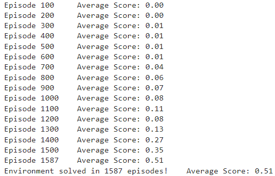

# Project-Collaboration-and-Competition---DRL
A project for training 2 agents be able to collaborate and play Tennis game
## Project Description
[//]: # (Image References)

[image1]: https://user-images.githubusercontent.com/10624937/42135623-e770e354-7d12-11e8-998d-29fc74429ca2.gif "Trained Agent"

![Trained Agent][image1]

In this environment, two agents control rackets to bounce a ball over a net. If an agent hits the ball over the net, it receives a reward of +0.1.  If an agent lets a ball hit the ground or hits the ball out of bounds, it receives a reward of -0.01.  Thus, the goal of each agent is to keep the ball in play.

The observation space consists of 8 variables corresponding to the position and velocity of the ball and racket. Each agent receives its own, local observation.  Two continuous actions are available, corresponding to movement toward (or away from) the net, and jumping. 

The task is episodic, and in order to solve the environment, your agents must get an average score of +0.5 (over 100 consecutive episodes, after taking the maximum over both agents). Specifically,

- After each episode, we add up the rewards that each agent received (without discounting), to get a score for each agent. This yields 2 (potentially different) scores. We then take the maximum of these 2 scores.
- This yields a single **score** for each episode.

The environment is considered solved, when the average (over 100 episodes) of those **scores** is at least +0.5.
## Getting Started

1. Download the entire repository and unzip (or decompress) the python.zip

2. Place the "python" folder in the working folder.

3. Follow the instructions in `Tennis.ipynb` to get started with training the agent! You can try tuning the hyperparameter as well!

4. You can also load the pretrained model weight provided to see how the agents work.

## Visualizing Results

The environment was solved in 1537 episodes with Average Score is 0.51

The visualization was not shown here because the server was down so we lost all the data! We will retrain and add it later!
